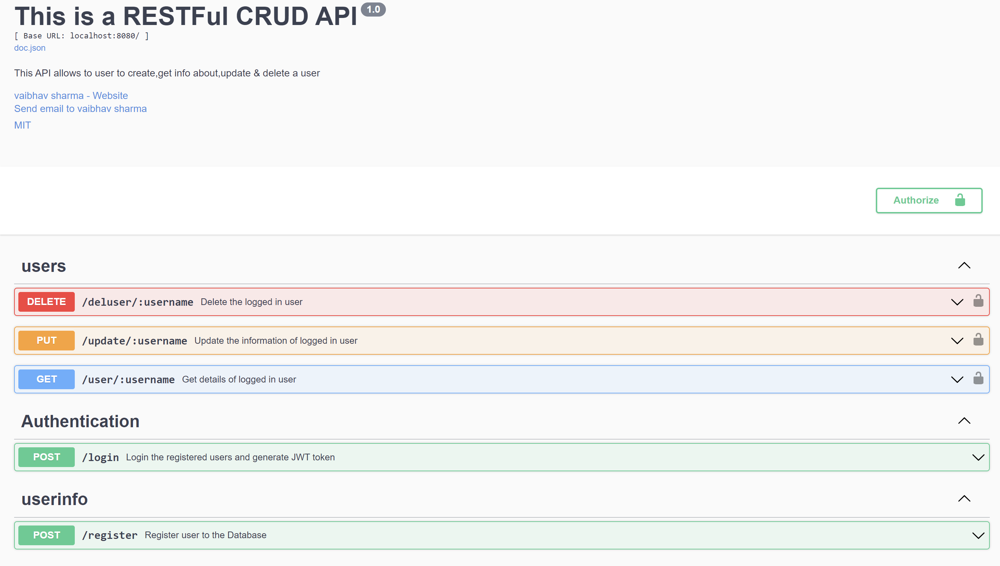
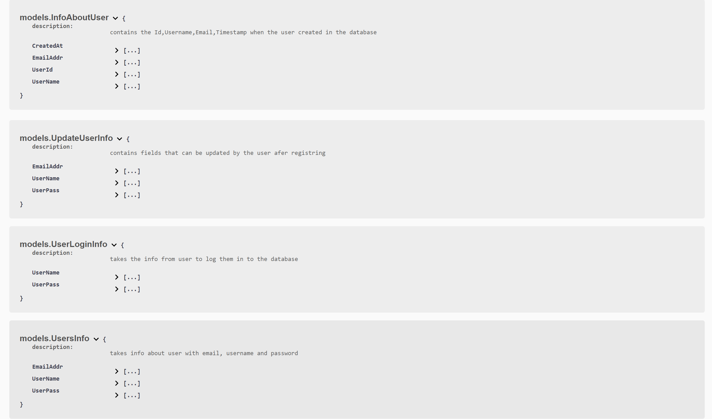

# RESTFul CRUD API
## Automated documentation using _Swagger_ with _JWT Authentication_
This is a RESTFUl CRUD API that Creates, Reads, Update and Delete the Users from a linked database, it uses _JWT Authentication_ to generate a token that is used for the authorization on the protected with the help of a middlware, it also utilises _swagger_ for API documentation using _swagger annotations_

## Table of Contents
- [Features](#features)
- [Technologies Used](#technologies-used)
- [Installation](#installation)
- [Usage](#usage)
- [Database Configuration](#database-configuration)
- [API Endpoints](#api-endpoints)
- [API Documentation](#api-documentation)
- [License](#license)
- [Contact](#contact)

## Features
- Create new users in the database
- Login into the database using regisrtered user's credentials
- Get information about logged in user
- Update user's information
- Delete the user who is logged in
- Authentication via JWT
- Swagger Documentation

## Technologies Used
- GO (Go lang)
- Gin (Web-Framework)
- JWT (JSON Web Token for Authentication)
- MySQL (Database to store user info)
- Swagger (API Documentation)

## Installation
To run this project locally, follow these steps

1. **Clone this repository:**
   
   ```bash
   git clone https://github.com/vaibhavsharma-a/CRUDUserGo.git
   cd CRUDUserGo

2. **Install Go:** Ensure you have Go installed on your machine. You can download it from the [official Go website](https://go.dev/dl/)
   
3. **Build Project:** Run the following command in the terminal to complie the code
   
   ```bash
   go build
This will create executable in your main directory

## Usage

1. **Run the API:** Run the generated executable to start your server
   ```bash
   ./CRUDUserGo
This will start a server on your localhost:8080

2. **Accessing Swagger Documentation:** Open your browser and navigate to [http://localhost:8080/swagger/index.html](http://localhost:8080/swagger/index.html) to view the API Documentation

## Database Configuration

### Database Connection

- **Database Type:** Create a MySQL database
  
- **DSN:** To connect to MySQL database you need to provide a Data Source Name (DSN). This contains all the important information that is needed to make a connection with the database
  ```Go
  DSN := username:password@tcp(hostname:port)/databasename

### Table Creation

- **User Table:** Create the following user table in your database to store the user information
   ```sql
   Create Table Users(
      UserId INT AUTO_INCREMENT PRIMARY KEY,
      UserName VARCHAR(30),
      UserPass VARCHAR(255),
      EmailAddr VARCHAR(40),
      CreatedAt TIMESTAMP DEFAULT CURRENT_TIME
   )

## API Endpoints

- POST /register : Register new user to the database
- POST /login : Login the registered users
- GET /user/:username : Retrieve the user's information from the database
- PUT /update/:username : Update the user's information present in the database
- DELETE /deluser/:username : Delete the logged in user from the database

_for more detailed information about the endpoints visit the swagger documentation for the API_

## API Documentation

Swagger is integrated in this project to create the automated documnetaion for the API with the help of variou swagger annotations. Swagger provied comprehensive API documentation, this documentation can be used by the user to get a better understanding of the various endpoints in the API, understand the structures and the request formats, and test the API directly from the browser by sending requests to those endpoints 

once you have navigated to http://localhost:8080/swagger/index.html on your browser, you will see something like this on your browser



you can also get a deeper insight of the API by looking at the types of structures it uses to pass the information back and forth



## License

This Project is licensed under the MIT License, See the LICENSE file for more details

## Contact

If you have any questions feel free to reach out:

- Name Vaibhav Sharma
- [Email](Vaibhav1863sharma@gmail.com)
- [Linkedin](https://www.linkedin.com/in/sharmaaavaibhav/)
  


  
